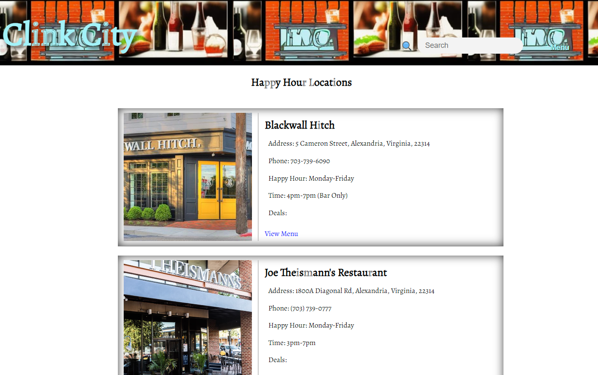
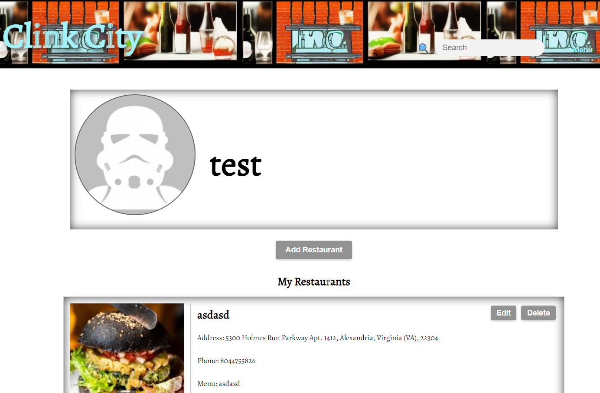
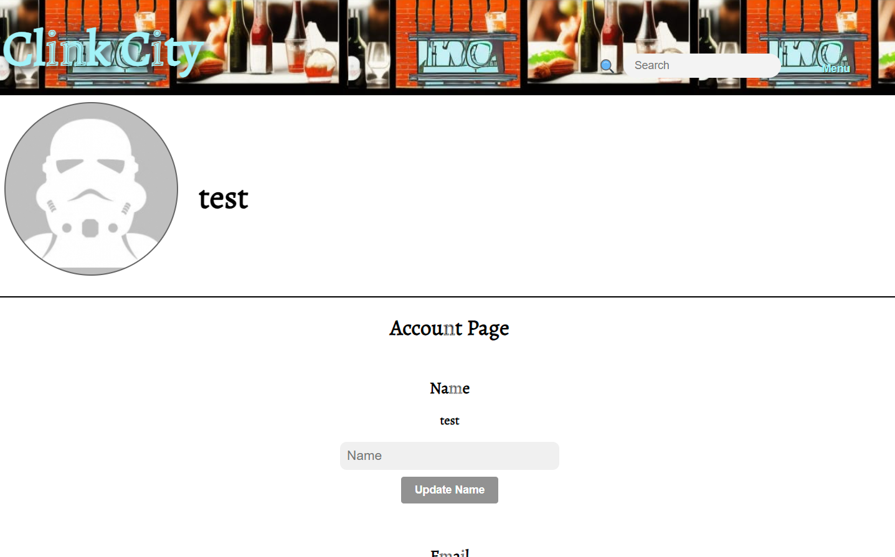

# Clink City - An App for Happy Hour Enthusiasts

## About

Welcome to Clink City. An app for consumers to find happy hour locations near them. No more endless googling. Clink City has (will) have it all for you. 


## Run App Locally

* Fork and clone down this repository
* cd into new dir
    * `cd into the-hour-of-happiness` dir
* run `npm install` to install dependencies
* open in your favorite code editor
* generate a .env file with `touch .env`
    * set up your dot env file like so:
        ```
        CLOUD_NAME = "your cloud name here"
        CLOUD_API_KEY = "your cloud API key here"
        CLOUD_API_SECRET_KEY = "your cloud API secret key here"
        CLOUDINARY_API_URL = "your cloud api upload url here"
        CLOUDINARY_UPLOAD_PRESET = "your cloud preset here"
        ```
* Once that is all done, run `npm start` to start app.

## Dependencies and scripts

| Dependency                 | Version   |
| -------------------------- | --------- |
| @cloudinary/react          | ^1.11.2   |
| @cloudinary/url-gen        | ^1.10.0   |
| @testing-library/jest-dom  | ^5.16.5   |
| @testing-library/react     | ^13.4.0   |
| @testing-library/user-event| ^13.5.0   |
| axios                      | ^1.4.0    |
| cloudinary-react           | ^1.8.1    |
| dotenv                     | ^16.0.3   |
| lodash.debounce            | ^4.0.8    |
| react                      | ^18.2.0   |
| react-calendar             | ^4.2.1    |
| react-dom                  | ^18.2.0   |
| react-icons                | ^4.8.0    |
| react-router-dom           | ^6.11.1   |
| react-scripts              | 5.0.1     |
| web-vitals                 | ^2.1.4    |

| DevDependency                       | Version    |
| ---------------------------------- | ---------- |
| @babel/core                        | ^7.21.8    |
| @babel/plugin-transform-modules-commonjs| ^7.21.5|
| @babel/preset-env                   | ^7.21.5    |
| @babel/preset-react                 | ^7.18.6    |
| babel-jest                         | ^29.5.0    |
| jest                               | ^27.5.1    |
| prettier                           | ^2.8.8     |

| Script   | Command               |
| -------- | --------------------- |
| start    | react-scripts start   |
| build    | react-scripts build   |
| test     | jest --verbose        |
| eject    | react-scripts eject   |


## Features:
1. Age Verification
2. User Authentication
    * Login and Signup
3. Users can add/edit/delete restaurants
    * Users has full CRUD on their own accounts
4. Dynamically rendering search bar
5. Links to restaurant menus

## Future Features 
1. Add event set up events
2. Add a map feature
    * load locations based on filtered parameters of distance
3. Add more filters for search feature
    * Time
    * Cost
    * Location
4. Add more login options
    * Facebook Login
    * Google Login

## Example SnapShots
### Welcome Page
<details>

<summary>Clich Here for SnapShot</summary>

</details>

### Login Page
<details>

<summary>Clich Here for SnapShot</summary>

</details>

### Choice Page

<details>

<summary>Clich Here for SnapShot</summary>

</details>

### Home Page

<details>

<summary>Clich Here for SnapShot</summary>

</details>

###  Profile Page

<details>

<summary>Clich Here for SnapShot</summary>

</details>

### Account Page

<details>

<summary>Clich Here for SnapShot</summary>

</details>


## Known Bugs
1. Account info does not automatically rerender on updates
2. User Authentication does not persist on Page refresh
3. Test Script not working correctly - es6 module issue with jest

## Developed with:

1. JavaScript
2. ReactJS
3. Cloudinary
4. Axios: for API requests

## Links

* Backend Repo: [The Hour Of Happiness](https://github.com/locb65/The-Hour-of-Happiness-Backend)
* Deployed Netlify Link: [Coming soon]()
* LinkedIn: [Loc Bui - LinkedIn](https://www.linkedin.com/in/loc-bui-b574ba128/)
* Twitter: [Coding-Locker](https://twitter.com/coding_locker)

# Thank You for checking this out!
